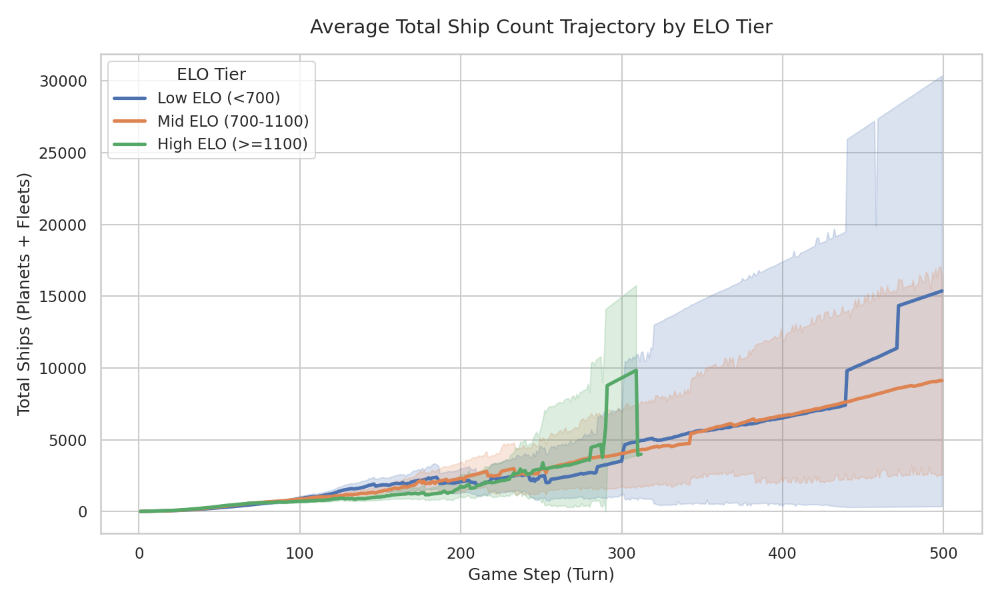
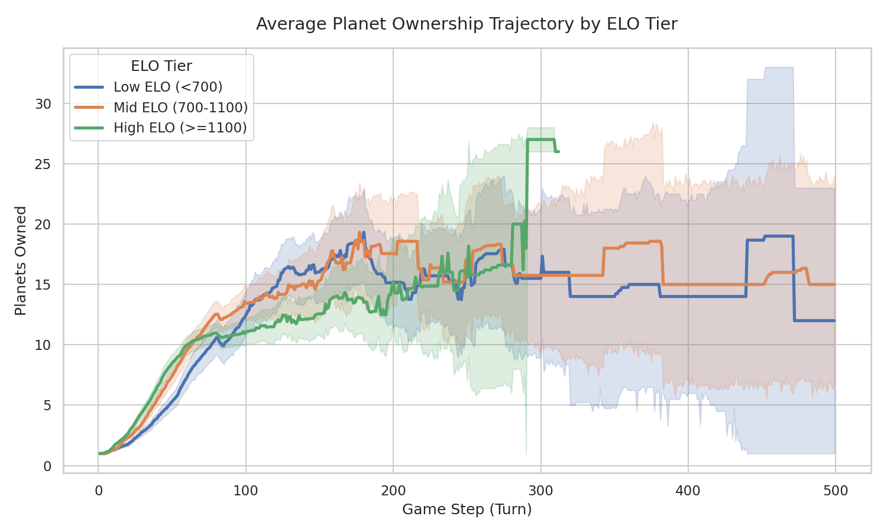
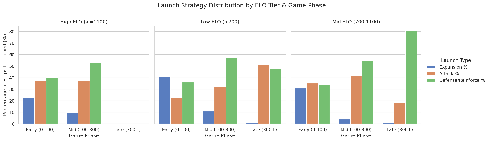
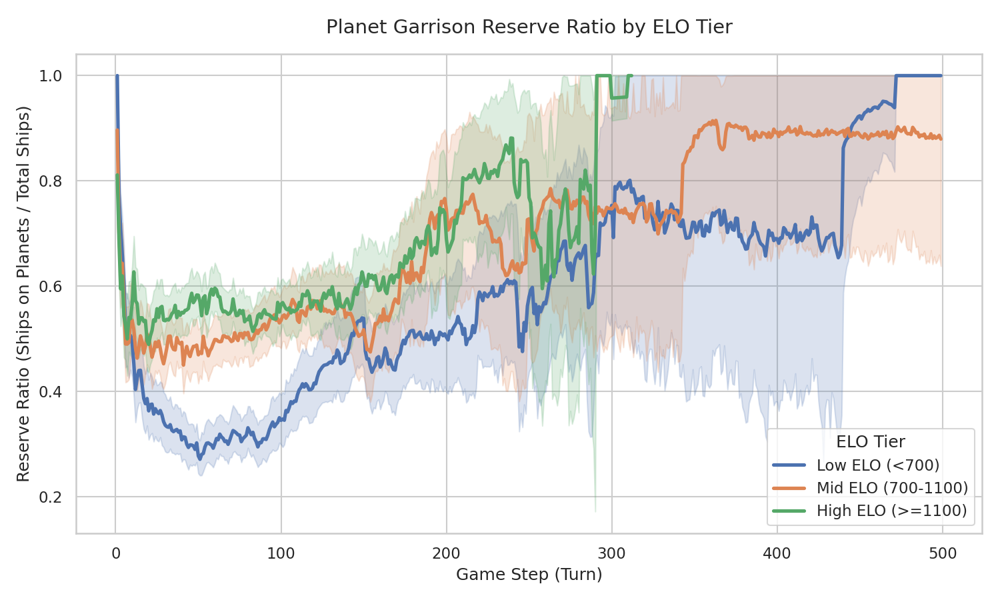
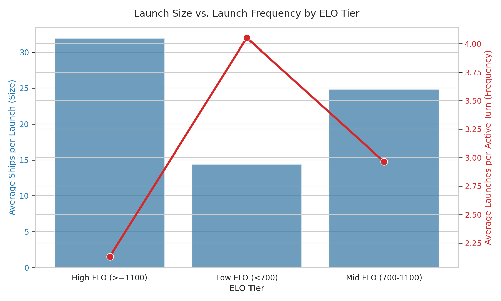

# Deep Replay Analysis: Strategy Takeaways from 10,547 Orbit Wars Games

This document summarizes a deep statistical analysis conducted on a dataset of **10,547 raw game replays** of Kaggle Orbit Wars, categorized by player ELO tiers:
- **Low ELO Tier**: $<700$ rating (1,650 games)
- **Mid ELO Tier**: $700$ to $1100$ rating (3,744 games)
- **High ELO Tier**: $\ge 1100$ rating (1,683 games)

The analysis reveals the core strategic differences that separate top-tier players from beginners.

---

## 1. Ship Count & Planet Ownership Trajectories

### Takeaways:
*   **The Ship Count Paradox**: Low ELO players accumulate *higher* average ship counts over the course of the game (mean: **1,298** ships) compared to High ELO players (mean: **756** ships). This occurs because High ELO matches are highly active and aggressive—ships are constantly spent in combats, leading to high attrition. Low ELO games often devolve into passive stalemates where ships build up without resolution.
*   **Decisive Early Expansion**: High ELO players capture planets much faster in the first 100 turns, establishing their economic base early. After Turn 100, planet counts plateau as the board fills up and contests become tighter, whereas Low ELO players expand much slower and miss early expansion opportunities.

---

## 2. Launch Strategy Mix (Early, Mid, Late Game)

### Takeaways:
*   **Early Game (Turns 0-100)**: High ELO players allocate **nearly 100% of launched ships to Expansion** (neutral planets). Low ELO players waste resources on early, uncoordinated attacks on the opponent.
*   **Mid Game (Turns 100-300)**: Once neutral planets are exhausted, High ELO players transition cleanly into a balanced strategy, splitting launches between **Defense/Reinforcement** fleets (**~50%**) and targeted **Attacks** (**~20-30%**).
*   **Late Game (Turns 300+)**: In the final phase, High ELO players focus heavily on reinforcement and defense to secure their ELO lead, while Low ELO players pivot to desperate attacks.

---

## 3. The Garrison Reserve Rule (The "Buffer" Strategy)

This plot shows the **Reserve Ratio** (Ships garrisoned on planets / Total ships).

### Takeaways:
*   **Defensive Buffer discipline**: High ELO players maintain a significantly higher reserve ratio of **58.7%** on average. They keep the majority of their ships garrisoned at home to absorb threats and prevent easy counter-captures.
*   **Beginner Overcommitment**: Low ELO players maintain a reserve ratio of only **43.2%**. They constantly empty their planets to launch small, weak fleets, leaving their home bases open to backdoors. 

---

## 4. Fleet Sizing: Launch Size vs. Frequency

### Takeaways:
*   **Quality over Quantity**: High ELO players launch **larger but fewer fleets** compared to Low ELO players. 
*   **Physics Exploitation**: In Orbit Wars, fleet speed scales log-exponentially with fleet size (larger fleets travel faster). By launching larger fleets, High ELO players ensure their fleets arrive *faster*, giving the opponent less time to react. Low ELO players launch frequent, tiny fleets that travel slowly and are easily intercepted.

---

## 5. Strategic Rules for Bot Development

To raise our bot's ELO to the top-tier (>1100+):
1.  **Early Expansion Focus**: In the first 100 turns, prioritize neutral planets aggressively and forbid attacks on the opponent.
2.  **High Garrison Reserves**: Keep at least **55-60%** of total ships garrisoned on owned planets, reinforcing them when threatened.
3.  **Large Launch Sizing**: Avoid launching small fleets (e.g., $<8$ ships). Bundle ships into larger, faster-moving fleets to exploit the speed-scaling mechanics.
